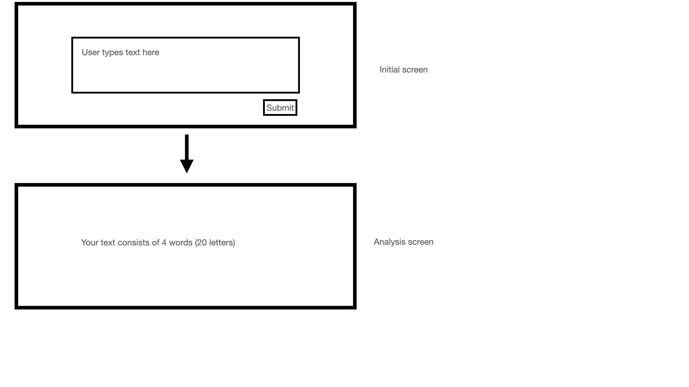

# Sample React App

Sample React App using functional components per a small exercise:

> The functionality of the web page is for the user to be able to submit a
> block of text and via a simulation of a slow external API receive the
> number of characters and words in the text for display.

## Usage

After checking out or downloading and extracting this repository, navigate a
shell instance to the folder and in order run the following to setup the
environment and start a local web server:

```sh
npm ci --omit="dev"
npm run dev
```

If you want to make sure you are running on the same version of node as me, it
has been documented under `engines` in package.json. Use a tool such as [fnm][]
to install the same version with:

```sh
fnm use --install-if-missing --resolve-engines
```

## Contraints & Prerequisites

- [x] Stand-alone web page application
- [x] Web server that can be started from the command line
- [x] npm
- [x] Typescript
- [x] ReactJS
- [ ] ~~Material-ui.com (version 4)~~

### Notes on constraints

Ignore the constrained on Material UI v4 and instead use the latest stable v5.



[fnm]: https://github.com/Schniz/fnm
