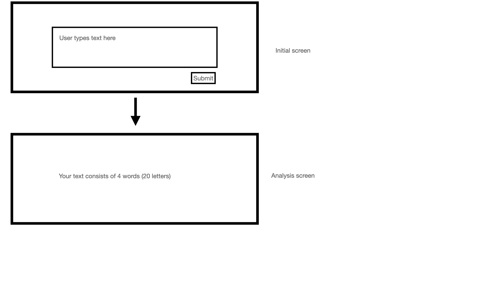

# Sample React App

Sample React App using functional components per a small exercise:

> The functionality of the web page is for the user to be able to submit a
> block of text and via a simulation of a slow external API receive the
> number of characters and words in the text for display.

[Check out the latest build.](https://zegnat.github.io/react-sample-app/)

## Usage

After checking out or downloading and extracting this repository, navigate a
shell instance to the folder and in order run the following to setup the
environment and start a local web server:

```sh
npm ci --omit="dev"
npm run dev
```

If you want to make sure you are running on the same version of node as me, it
has been documented under `engines` in package.json. Use a tool such as [fnm][]
to install the same version with:

```sh
fnm use --install-if-missing --resolve-engines
```

## Contraints & Prerequisites

- [x] Stand-alone web page application
- [x] Web server that can be started from the command line
- [x] npm
- [x] Typescript
- [x] ReactJS
- [ ] ~~Material-ui.com (version 4)~~

### Notes on constraints

Ignore the constraint on Material UI v4 and instead use the latest stable v9.



## Production

Special care has been taken to make sure the code results in a very lean final
production build.

1. Always check where bundle size originates. To inspect the final bundle,
   [vite-bundle-visualizer][] is manually run. This has helped to decide on how
   and which Material UI components are imported. E.g. it was discovered that
   the `TextField` component would always bundle code to potentially render a
   `Select`, so instead `OutlinedInput` is used.

   ```sh
   npx vite-bundle-visualizer --config vite.build.config.mts --sourcemap
   ```

2. React is replaced with Preact, using [@preact/compat][], on build. All code
   is written and tested in development using React before switching it in the final bundle to save on size.

   The difference in size can be confirmed by running the vite-bundle-visualizer
   with and without the `--config` flag to compare development and production
   bundles with eachother.

To build a distribution ready for deployment make sure all dependencies
(including `devDependencies`) are installed.

```sh
fnm use --install-if-missing --resolve-engines
npm ci
npm run build
```

To view the distribution build in a browser after bundling, run:

```sh
npm run preview
```

## Testing

End-to-end tests use [Playwright][]. The same tests run against both the
development build (React) and the production build (Preact) to catch
regressions in either runtime.

Because `ignore-scripts=true` is set in `.npmrc`, Playwright's browser
binaries are not downloaded automatically. Install them once after
`npm ci`:

```sh
npx playwright install chromium
```

Run all tests (both React and Preact):

```sh
npm run test:e2e
```

Or target a specific runtime:

```sh
npm run test:e2e:react   # React dev server only
npm run test:e2e:preact  # Preact production build only
```

Note: the app simulates a slow API call (10 seconds), so each test run
takes roughly 15 seconds.

[@preact/compat]: https://www.npmjs.com/package/@preact/compat
[fnm]: https://github.com/Schniz/fnm
[Playwright]: https://playwright.dev/
[vite-bundle-visualizer]: https://www.npmjs.com/package/vite-bundle-visualizer
