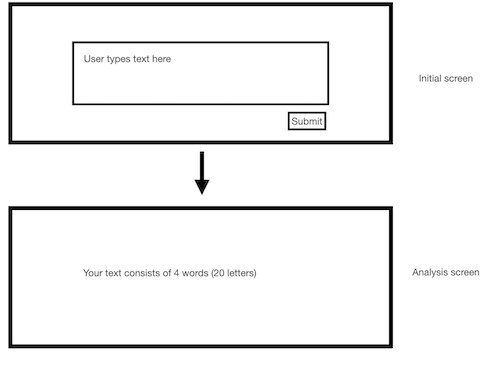

# Sample React App

Sample React App using functional components per a small exercise:

> The functionality of the web page is for the user to be able to submit a
> block of text and via a simulation of a slow external API receive the
> number of characters and words in the text for display.

## Usage

After checking out or downloading and extracting this repository, navigate a
shell instance to the folder and in order run the following to setup the
environment and start a local web server:

```sh
npm ci
npm run dev
```

If you want to make sure you are running on the same version of node as me, a
`.node_version` file has been included for use with tools like [fnm][].

## Contraints & Prerequisites

- [x] Stand-alone web page application
- [x] Web server that can be started from the command line
- [x] npm
- [x] Typescript
- [x] ReactJS
- [x] Material-ui.com (version 4)

## Notes on constraints

As of 2023-11-20 the final release of Material UI v4 is [v4.12.4][latest-mui].
This also limits the version of React that can be used in this repository to
major version 17. The final release here is [v17.0.2][latest-react].



[fnm]: https://github.com/Schniz/fnm
[latest-mui]: https://github.com/mui/material-ui/releases/tag/v4.12.4
[latest-react]: https://github.com/facebook/react/releases/tag/v17.0.2
